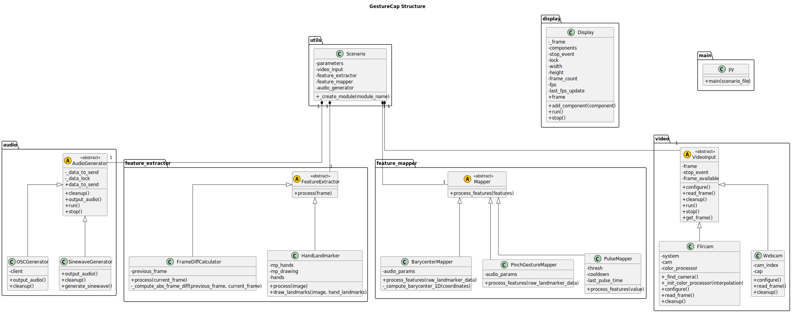
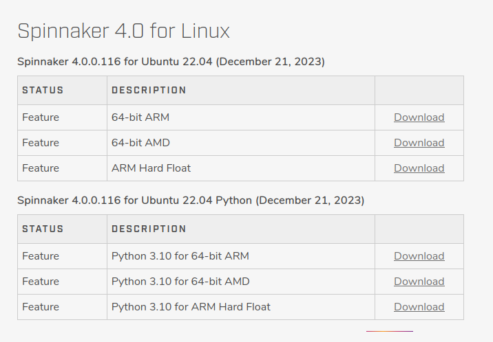

# GestureCap


**Google Summer of Code 2024 project**


GestureCap is a real-time hand gesture recognition system that leverages computer vision and audio synthesis techniques to map hand movements to sound parameters. It allows for expressive and interactive sound generation controlled by hand gestures.

## Required Tools

- **Python 3.10.14**
- **uv**: A faster alternative to `pip` for installing Python packages.
- **Pure Data (Pd)**: A visual programming language for real-time audio synthesis and processing.
- **MediaPipe hand landmarker model**: You'll need to download the `hand_landmarker.task` file.

### Project structure

<div align="center"></div>

<div id="installation"/>

## Installation

1. **Clone the repository**

``` bash
git clone git@github.com:lmartinez2001/gsoc.git
cd GestureCap
```


2. **Install `uv`**

`uv` is a faster alternative to `pip`. Install it globally using `pip`:

``` shell
pip install uv 
```


3. **Create a virtual environment and activate it**

> [!IMPORTANT]
> GestureCap is developed in python 3.10.14
> Make sure the same version is installed on your systeùm to avoid any conflict

``` shell
uv venv -p 3.10
source .venv/bin/activate
```

4. **Install dependencies using `uv`**

``` shell
uv pip install -r requirements.txt
```

> [!IMPORTANT]
> If you're planning to use a Flir camera and haven't installed the SDK yet, jump to the [spinnaker SDK installation](#spinnaker) section. 

<div id="installation-step5"/>

5. **Download the MediaPipe hand landmarker model**

You'll need to download the `hand_landmarker.task` file and place it in the root directory of the project.

``` shell
wget -q https://storage.googleapis.com/mediapipe-models/hand_landmarker/hand_landmarker/float16/1/hand_landmarker.task
```

6. **Set up Pure Data**

+ **Install Pure Data**: If you haven't already, download and install Pure Data from the official website: https://puredata.info/downloads
+ **Open the patch**:
  - Launch Pure Data
  - Go to `File -> Open` and navigate to the `puredata` directory within the GestureCap project.
  - Select the appropriate `.pd` file for the scenario you want to run. For example, for the `barycenter_scenario.yml`, open `barycenter_demo.pd`.

7. **Run a scenario**

``` shell
python main.py --scenario scenarios/<scenario_name>.yml
```

Replace `<scenario_name>` with the desired scenario file (e.g., `main_scenario.yml`, `barycenter_scenario.yml`).

**Start the audio in Pure Data**: For scenarios that interact with Pure Data (like `barycenter_scenario.yml`), make sure to enable audio playback within the Pure Data patch. Refer to the specific patch's instructions for details.

## Contributing

GestureCap is composed of several modules which can be plugged together to create a music generation pipeline. There are 4 main modules and some additional modules developped for debugging and measurements purpose.

The general structure of the pipeline is as follows:
<div align="center"></div>

1. **Video input**: Refers to any video input stream. It can come from a camera or pre recorded video. For now only webcams and [Flir](https://www.flir.com/) cameras are supported.

> [!NOTE]
> The Flir camera we used is a that we used is a [Blackfly S BFS-U3-04S2C](https://www.flir.fr/products/blackfly-s-usb3/?vertical=machine+vision&segment=iis). As this camera has a bunch of configurable parameters, the cooresponding wrapper class uses the ones fitting this model the best. Therefore these parameters should be adapted if another model is used. For additional information on how to setup the environment for Flir cameras, jump to [Installing Spinnaker SDK](#spinnaker) section.

2. **Feature Extractor**: When a frame is grabbed by the program, this module extracts relevant features that can then be used to guide the audio output. The only production ready extractor for now is based on the [Mediapipe HandLandmarker](https://ai.google.dev/edge/mediapipe/solutions/vision/hand_landmarker) model. Hence it allows to extract hand keypoints whose position can then be mapped to some audio parameters. 

3. **Feature Mapper**: Once relevant features are extracted from a frame (e.g hand landmarks coordinates), this module processes and convert them into a set of parameters which are then interpreted by the audio generator. As a processing example, one could think of computing more relevant features based on the raw ones output by the Features extractor (e.g: Distance between landmarks, barycenter, etc.).

4. **Audio Generator**: This modules handles the final conversion from the predetermined audio parameters (stored in a dictionary for instance) to actual chunk of data that can be interpreted by either the audio drivers of the device running the program, or any third party software able to interpret signals output by the generator.

> [!NOTE ]
> Although a variety of signals could be handled (e.g MIDI,bytes), this project mainly focuses on Open Sound Control (OSC) signals for their flexibility and the common use in the electronic music field. What's more, Pure Data is the only third party software to be tested. But as it's only in charge of receiving OSC signals a outputting sound, any similar software (e.g Max/MSP) will work.

Every package corresponding to a major module has a `README` file containing a tutorial about how to expand it.


<div id="spinnaker" />

## Installing Spinnaker SDK


Flir cameras can be programmatically controlled with the [Spinnaker SDK](https://www.flir.com/products/spinnaker-sdk/?vertical=machine+vision&segment=iis). One will have to login (or signup first) to the website and download the version corresponding to your OS.

> [!NOTE]
> For Linux versions, the SDK officially supports only Ubuntu. However, all the experiments were carried out under Arch Linux with no incompatibility at all.

1. **Download the SDK**

Download the SDK corresponding to your os and architectire:
<div align="center"></div>

> [!NOTE]
> If one doesn't want to use the wheel of the python library provided in the `dependencies` directory, one can downlaod from the same page. However beware that there might me some imcompatibilities if it's a different version as the provided one.

2. **Install the SDK**

Follow the installation steps for the SDK, according to your OS. To make sure the SDK works well with the camera, connect the latter to your computer and start Spinview. The camera should be detected and you should be able to change its parameters and start acquiring images from the GUI of Spinview.

3. **Install `spinnaker-python`**

It's assumed that steps 1 to 4 of the [Installation section](#installation) are done.  
From the root directory of the project run:

``` shell
uv pip install ./dependencies/spinnaker_python-4.0.0.116-cp310-cp310-linux_x86_64.whl
```

From here you can go jump back to [step 5](#installaton-step5) of the installation section.
