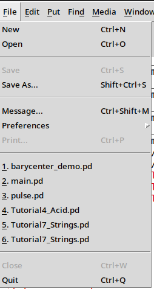
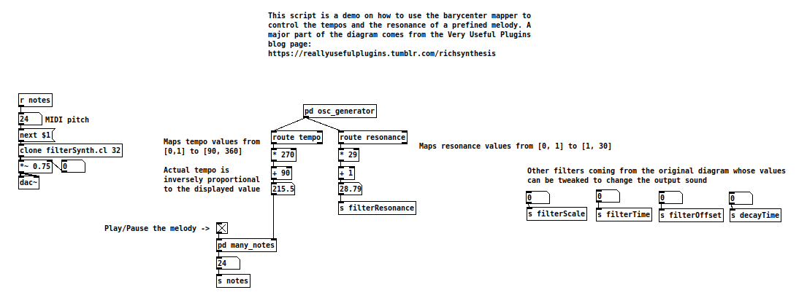
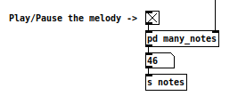

# Tutorial: Implementing the `body_pose_detector` Script

In this tutorial, we will create a `body_pose_detector` script that calculates the 

> [!WARNING]
> This tutorial doesn't cover comprehensively the PureData part. Some [useful links](#useful-links) can be found at the end of the tutorial

The file defines a default melody to which several filters can be applied. It is configured to wait for 2 OSC signals from the `tempo` and `resonance` routes. 
1. tempo: value between 0 and 1 allowing to vary the tempo of the melody
2. resonance: value between 0 and 1 in charge of tuning the effect of a resonance filter

To match the range of values expected by both features mentioned above within PureData, an affine transformation is applied to the received values in PureData. For instance, the resonance value received is between 0 and 1, hence it's mapped between 1 and 30 because it makes more sense in the PureData framework.

Finally, other filters can be manually tuned to change the envelop of the output sound.

> [!TIP]
> It's possible to control any fiter by either connecting the output of an OSC route to the input of the filter to control, or, as illustrated in this tutorial, by creating another route bound to another feature coming from the main program.

We'll map the normalized (x,y) position of the barycenter in the following way:
+ x: Tunes the value of the resonance filter by increasing it's parameter as the barycenter navigates from left to right
+ y: Controls the tempo. The higher, the faster

The final implementation is already in the repository and fully working.

## 1. Create the `body_pose_detector.py` File

Navigate to the `feature_mapper` directory within your project and create a new Python file named body_pose_detector.py.

``` bash
cd feature_mapper
touch body_pose_detector.py
```


## 2. Import Necessary Modules


Open `body_pose_detector.py` and import the required modules:

``` python
from .mapper import Mapper
import numpy as np
```

## 3. Define the `BarycenterMapper` Class

Create a class named `BarycenterMapper` that inherits from the `Mapper` class.

``` python
class BarycenterMapper(Mapper):

    def __init__(self):
        self.audio_params = {
            'tempo': 0.5,       # Default normalized tempo
            'resonance': 0.5    # Default normalised resonance level
        }
```
    

## 4. Implement the process_features Method

Add the process_features method to the BarycenterMapper class. This method will calculate the barycenter of the hand landmarks and map its coordinates to frequency and volume.

> [!NOTE]
> We add a small helper function to compute the barycenter. 

``` python
    def process_features(self, raw_landmarker_data: dict) -> dict:

        hand_landmarks = raw_landmarker_data.get('landmarks') 

        if hand_landmarks:
            # Only processing the first detected hand 
            landmarks = hand_landmarks[0] 

            # Calculate the barycenter 
            barycenter_x = np.mean([lm.x for lm in landmarks])
            barycenter_y = np.mean([lm.y for lm in landmarks])


            self.audio_params['tempo'] = barycenter_y 
            self.audio_params['resonance'] = barycenter_x

        return self.audio_params
        

    def _compute_barycenter_1D(self, coordinates: list) -> float:
        return np.mean(coordinates)

```

## 5. Update `feature_mapper/__init__.py`

Import and add the BarycenterMapper to the `__all__` list in `feature_mapper/__init__.py`.

``` python
# ... other imports
from .body_pose_detector import BarycenterMapper

__all__ = [
    # ... other mappers
    'BarycenterMapper'
]
```

## 6. (Optional) Create a `barycenter_scenario.yml` scenario file

Navigate to the `scenarios` directory and create the `barycenter_scenario.yml` scenario file

``` bash
cd scenarios
touch barycenter_scenario.yml
```

Fill the file with the following configuration:

``` yaml

scenario: Barycenter demo

video_input:
  class: Webcam
  params:
    cam_index: 0

feature_extractor:
  class: HandLandmarker

feature_mapper:
  class: BarycenterMapper

audio_generator:
  class: OSCGenerator
  params:
    ip: "127.0.0.1"
    port: 11111
```


In this configuration the feature_mapper section is filled with `BarycenterMapper`

## 7. (Optional) Run the program with the new configuration

First make sure that the corresponding PureData diagram is loaded. It can be found under `puredata/barycenter_demo.pd`

1. In PureData go to `File ->  Open` and select the `barycenter_demo.pd` file
<div align="center"></div>
<div align="center"></div>

2. Locate the *Play/Pause the melody* check box and tick it. You should hear a melody
<div align="center"></div>

3. Start the main program:

``` bash
python main.py --scenario scenarios/barycenter_scenario.yml
```

A display should appear and moving your hand in front of the camera will change the output audio.

## Useful links
<a id="useful-links"></a>

- [Blog page from which the PureData script is widely inspired](https://reallyusefulplugins.tumblr.com/richsynthesis)
